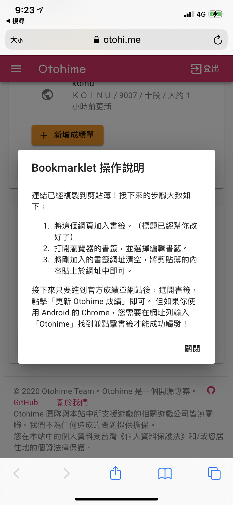
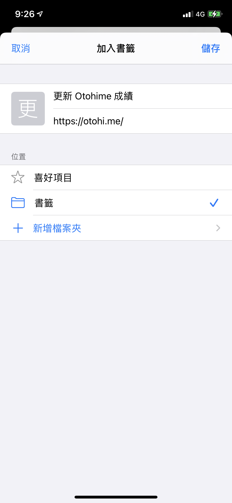
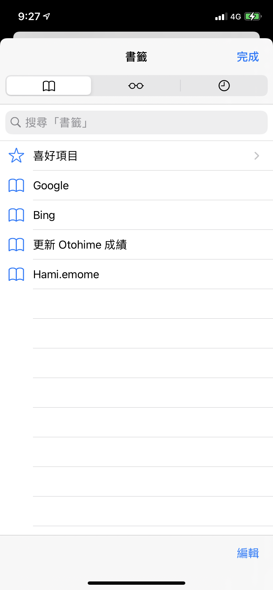
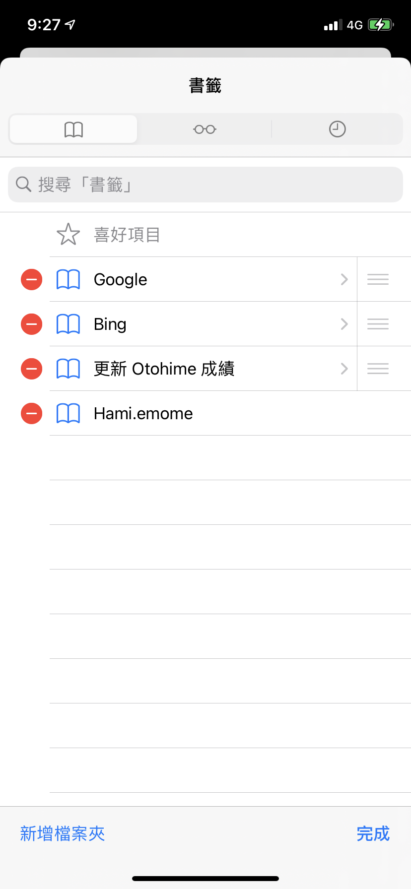
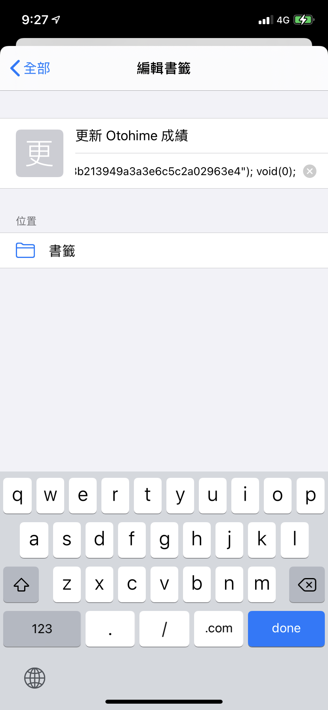
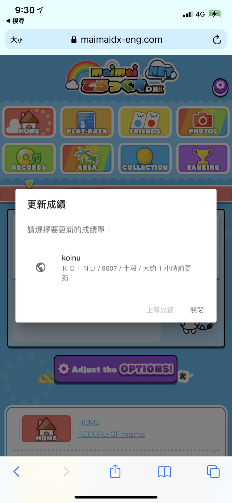

# Bookmarklet 操作說明

### 桌面瀏覽器（以 Google Chrome 為例）

1. 請先顯示你的的書籤列，到功能表→書籤→選擇「顯示書籤列」。

2. 進到 Otohime 網站首頁，產生權杖後，把「更新 Otohime 成績」按鈕拖曳到書籤列。

3. 進入 maimai DX NET 國際版首頁後，再點一下「更新 Otohime 成績」即可。

### iOS / iPadOS（以 Safari - iPhone XR 為例）

1. 以 Safari 進入 Otohime 首頁（請不要使用 App 內瀏覽器，因為沒有書籤 \|\|\|\|）
2. 產生權杖後，按下「更新 Otohime 成績」按鈕。這時將會將 Bookmarklet 連結到剪貼簿。  

   

3. 按下中間「↑」標誌的分享按鈕後，選擇下面的「加入書籤」。  
   

4. 現在還不能改網址 QQ，位置選擇「書籤」後，按下「儲存」。  

   

5. 按下分享按鈕右邊書本圖示的書籤按鈕，進入書籤頁面。  

   

6. 按一下右下角的「編輯」，再點下「更新 Otohime 成績」右邊的小箭頭。  

   

7. 編輯時把網址欄清空後，長壓網址欄，貼上 Bookmarklet 連結。  

   

8. Back 回書籤頁後，按「完成」。Bookmarklet 搞定了！
9. 打開 DX NET 國際版首頁，點一下書本按鈕的書籤後，選擇「更新 Otohime 成績」
10. 恭喜你成功了！

