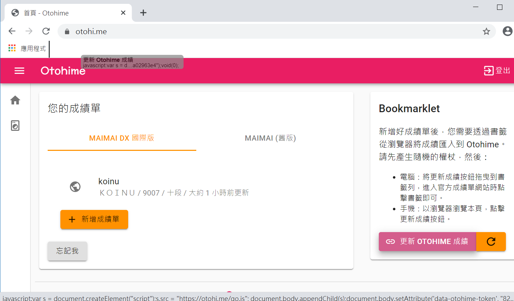

# Bookmarklet 操作說明

### 桌面瀏覽器（以 Google Chrome 為例）

1. 請先顯示你的的書籤列，到功能表→書籤→選擇「顯示書籤列」。

.png>)

2\. 進到 Otohime 網站首頁，產生權杖後，把「更新 Otohime 成績」按鈕拖曳到書籤列。

3\. 進入 maimai DX NET 國際版首頁後，再點一下「更新 Otohime 成績」即可。

.png>)

### iOS / iPadOS（以 Safari - iPhone XR 為例）

1. 以 Safari 進入 Otohime 首頁（請不要使用 App 內瀏覽器，因為沒有書籤 ||||）
2.  產生權杖後，按下「更新 Otohime 成績」按鈕。這時將會將 Bookmarklet 連結到剪貼簿。\

    .PNG>)
3.  按下中間「↑」標誌的分享按鈕後，選擇下面的「加入書籤」。\
    

4.  現在還不能改網址 QQ，位置選擇「書籤」後，按下「儲存」。\

    
5.  按下分享按鈕右邊書本圖示的書籤按鈕，進入書籤頁面。\

    
6.  按一下右下角的「編輯」，再點下「更新 Otohime 成績」右邊的小箭頭。\

    
7.  編輯時把網址欄清空後，長壓網址欄，貼上 Bookmarklet 連結。\

    
8. Back 回書籤頁後，按「完成」。Bookmarklet 搞定了！
9. 打開 DX NET 國際版首頁，點一下書本按鈕的書籤後，選擇「更新 Otohime 成績」
10. 恭喜你成功了！

### Android（以 Google Chrome - Xperia XZ 為例）

1. 以 Google Chrome 開啟 Otohime 首頁。
2.  產生權杖後，按下「更新 Otohime 成績」按鈕。這時將會將 Bookmarklet 連結到剪貼簿。\

    
3.  按下右上功能表，點擊上面的星星，將此頁加入書籤。\

    
4. 再點一次右上功能表，進入「書籤」。
5.  選擇「行動版書籤」。\

    
6.  找到「更新 Otohime 成績」，點擊右側的三個點功能表，按「編輯」。\

    
7.  網址清空後貼上 Bookmarklet 連結。\

    
8. 按 Back 兩次後按 X 關閉書籤視窗。Bookmarklet 至此設定完成。
9. 進到 DX NET 國際版首頁。
10. 點擊網址列，陸續輸入「otohime」，直到看到「更新 Otohime 成績」項目為止。\

    
11. 恭喜你成功了！

